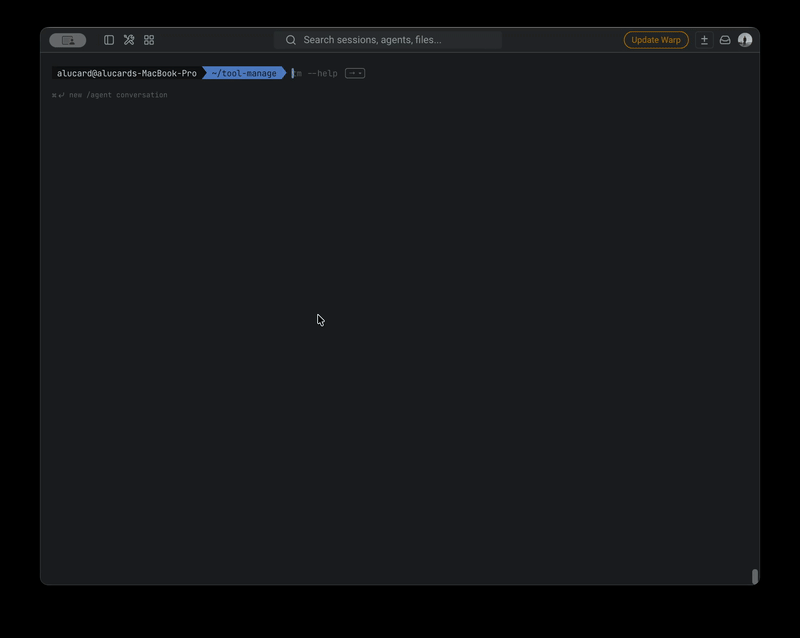
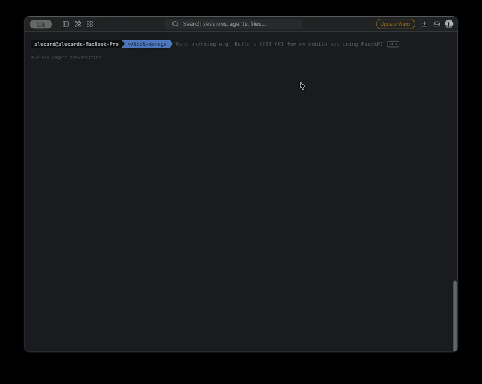
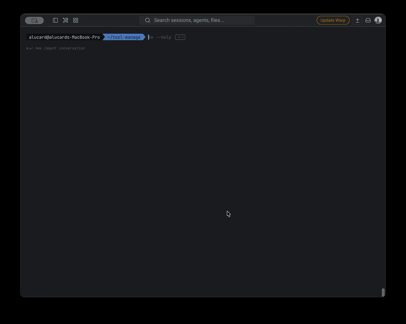

[中文](./README_ZH.md) | English

# tool-manage

Give your local CLI toolbox a memory.

`tool-manage` is a tiny sqlite-backed registry for the CLI tools, scripts, and internal commands that already live on your machine.

With the `tm` command, you can register a command from `PATH`, import a hand-written JSON spec, store useful metadata, inspect help output later, update records, and retire old commands without losing history.

It is built for developers who have more local tools than they can comfortably remember.

---

## Why?

Modern developer machines are full of small tools:

- global npm / pnpm commands
- shell scripts
- internal CLIs
- AI coding helpers
- one-off automation commands
- private tools without good package metadata

After a while, the problem is not installation.

The problem is memory:

- What does this command do?
- Where is its repo?
- Who maintains it?
- How do I use it?
- Is it still active?
- Why did I add it in the first place?

`tool-manage` gives these commands a local registry.

---

## What it does

- Register commands already available on your machine
- Read package metadata when possible
- Store descriptions, versions, authors, repositories, and help output
- Import command records from local or remote JSON specs
- Generate starter JSON specs for private scripts
- Edit and update stored metadata
- Soft-delete old commands without losing history
- Keep everything local in sqlite

---

## Quick demo

### Add a local command and inspect it

`tm` can discover a command from `PATH`, save its metadata, and show it in a readable table.



### Show a registered command

Use `tm --show <command>` when you want to see the stored description, version, repository, author, and help preview in one place.


### Generate a starter JSON spec

For private scripts or internal tools, `tm --generate` gives you a valid JSON skeleton that you can complete and import later.



### Retire an old command

`tm --remove <command>` soft-deletes the command so it disappears from the active list without deleting its history.



---

## Install

```bash
npm install -g @alucpro/tool-manage
```

or:

```bash
pnpm add -g @alucpro/tool-manage
```

Requires Node.js >= 18.

---

## Basic usage

### Add a command from your machine

```bash
tm --add pnpm
tm --add node
tm --add your-local-script
```

`tm` resolves the command from your `PATH`, inspects package metadata when possible, and stores a help preview for later lookup.

### List registered commands

```bash
tm
```

### Show command details

```bash
tm --show pnpm
```

### Edit stored metadata

```bash
tm --edit pnpm
```

### Refresh command metadata

```bash
tm --update pnpm
```

### Generate a command spec

```bash
tm --generate
tm --generate sync-notes
```

### Add a command from JSON

```bash
tm --add ./my-command.json
tm --add https://example.com/my-command.json
```

This is useful for private scripts, internal tools, or commands that do not expose a useful `package.json`.

### Remove a command from the active list

```bash
tm --remove pnpm
```

Removal is soft deletion. The record is retired, not physically erased.

---

## Example workflow

```bash
tm --add pnpm
tm --show pnpm
tm --update pnpm

tm --generate sync-notes
tm --add ./sync-notes.json

tm --remove old-script
```

---

## When should I use this?

Use `tool-manage` if you:

- keep forgetting what your local commands do
- maintain many personal scripts
- work with internal CLI tools
- use AI coding tools and automation scripts
- want a local catalog of useful developer commands
- need metadata for tools that do not have proper package information

It is especially useful when you are building a personal developer toolbox or an AI-assisted coding workflow.

---

## When should I not use this?

You probably do not need `tool-manage` if:

- you only use a few well-known global commands
- you are looking for a package installer
- you want version switching like `nvm`, `volta`, or `mise`
- you want a full task runner or workflow engine

`tool-manage` does not replace package managers or version managers.

It adds a memory layer on top of the commands you already have.

---

## How is it different?

| Tool type | Main purpose | What `tool-manage` adds |
| --- | --- | --- |
| npm / pnpm global install | Install packages | Remember and inspect installed commands |
| nvm / volta / mise | Manage runtimes and versions | Catalog command metadata |
| shell aliases | Shorten commands | Store descriptions, repos, authors, help output |
| README files | Document tools manually | Keep a searchable local registry |
| task runners | Execute workflows | Manage command records and context |

---

## AI JSON Spec

If you want an AI coding assistant to generate a command record that `tm --add` can ingest, use these docs:

- [AI Command JSON Spec](./docs/AI_COMMAND_JSON_SPEC.md)
- [AI Command JSON Spec (Chinese)](./docs/AI_COMMAND_JSON_SPEC_ZH.md)

They are designed to be pasted into an AI workflow together with a shell script or CLI project.

Example use case:

> “Read this shell script and generate a `tool-manage` JSON spec for it.”

Then import it:

```bash
tm --add ./generated-command.json
```

---

## Storage

Runtime data lives in:

- sqlite database: `~/.tool-manage/tool-manage.db`
- editable templates: `~/.tool-manage/templates/`
- schema reference: [schema/sqlite.sql](./schema/sqlite.sql)

`tm --remove` uses soft deletion through `commands.deleted_at`, so records can be retired without losing history.

---

## Local development

```bash
pnpm install
pnpm test
pnpm start -- --help
```

More details:

- [Local Test Guide](./docs/LOCAL_TEST.md)
- [本地测试说明](./docs/LOCAL_TEST_ZH.md)

---

## Compatibility

V2 still accepts a few older aliases:

- `tm --register <command>` -> `tm --add <command>`
- `tm --refresh <command>` -> `tm --update <command>`
- `tm --unregister <command>` -> `tm --remove <command>`

---

## Roadmap ideas

- Better search and filtering
- Tag support
- Export / import registry
- Interactive command picker
- Better AI-generated command specs
- Optional web UI for browsing local tools

---

## Author

Built by Xuming.

Personal site:

- [https://dg.aluc.me](https://dg.aluc.me)

If this tool helps your CLI workflow, issues and ideas are welcome.
